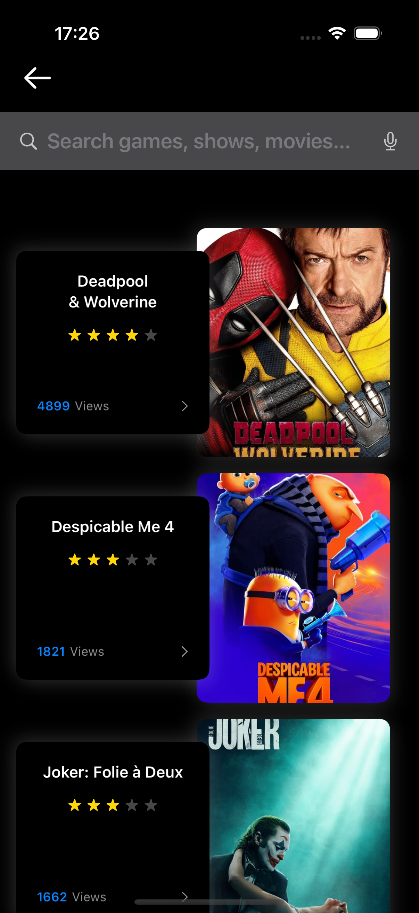
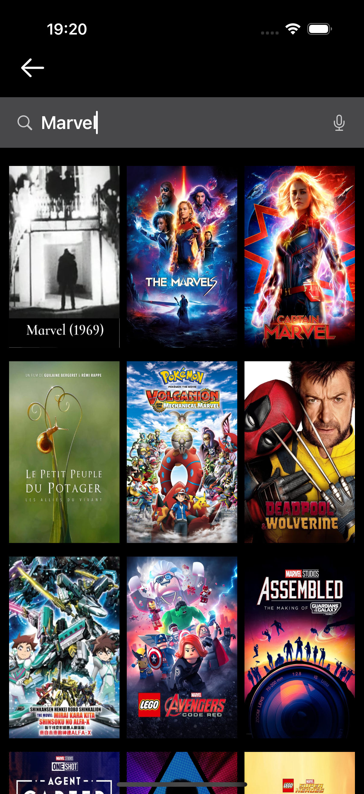

# NetflixCloneSwiftUI

A clone of the Netflix application developed using SwiftUI and UIKit, employing the MVVM architecture. The project features a modern and dynamic interface inspired by the original app's design, including search functionality, movie viewing, and recommendation management.

## Table of Contents

- [Requirements](#requirements)
- [Technologies Used](#technologies-used)
- [Screens](#screens)
- [Project Architecture](#project-architecture)
- [Features](#features)
- [Installation](#installation)
- [Usage](#usage)
- [Testing](#testing)
- [References](#references)
- [Contributions](#contributions)
- [How to Contribute](#how-to-contribute)
- [License](#license)

## Requirements

Before starting, make sure you have the following requirements installed:

- **Xcode** (Version 16.0 or higher)
- **macOS** (Version 15 or higher)
- **Swift 6**
- **XcodeGen** For project generation.

## Technologies Used

- **Swift 6**: Main programming language.
- **SwiftUI**: For building the user interface.
- **UIKit**: For integrating with existing components and gaining more control over the UI.
- **MVVM (Model-View-ViewModel)**: For separating concerns and better code organization.
- **XCTest, Testing, Unit and UI**: Used to do the tests.
- **XcodeGen**: A tool for generating Xcode projects from YAML files.
- **URLSession**: Used to make project requests.
- **Combine**: For customize the handling of asynchronous events.
- **Testing**: For additional unit tests.
- **Swift Snapshot Testing**: To test the appearance of the interface in different states.
- **API public**: https://developer.themoviedb.org/docs/getting-started
- **SDWebImageSwiftUI**: Image loading.

## Screens

<p align="center">
  
  
</p>

<p align="center">
  
  
</p>

<p align="center">
  
  
  
</p>

<p align="center">
  
  
</p>

<p align="center">
  
  
</p>

## Project Architecture

The MVVM architecture was chosen for this project, providing a clear separation between business logic (Model), presentation logic (ViewModel), and the user interface (View).

### Project Structure

```bash
NetflixClone
│
├── NetflixClone
│
├── NetflixCloneSample
│
├── NetflixCloneTests 
│
├── NetflixCloneUITests 
│
```

## Features

- **Navigation**: Intuitive navigation between different sections of the app.
- **Search**: Search functionality to find movies and series.
- **Recommendations**: Display of personalized recommendations for the user.
- **Movie Details**: Viewing detailed information about movies and series.

## Installation

To install and run the project, follow the steps below:

## Using XcodeGen

1. **Install XcodeGen (if you haven't already)**:

```bash
brew install xcodegen
```

2. **Clone the repository**:

```bash
git clone https://github.com/jovitorneves/NetflixCloneSwiftUI.git
cd NetflixCloneSwiftUI
```

3. **Generate the Xcode project**

```bash
xcodegen
```

4. **Open the Project in Xcode**

Navigate to the directory where you cloned the project and open the `.xcodeproj` file in Xcode.

```bash
open NetflixClone.xcodeproj
```

5. **Run in Simulator or Device**

In Xcode, select the target (simulator or physical device) and click the **Run** button (play icon) to build and run the application.

## Troubleshooting

If you encounter a "permission denied" error while running xcodegen, it may be due to insufficient permissions for the current user. Here are a few solutions to resolve this issue:

 1. Check File Permissions: Ensure that you have the correct permissions for the project directory. You can change the permissions by running:

 ```bash
chmod 755 scripts/{change_to_file_name}.sh
```

## Usage

After opening the application, you will be able to navigate through the sections and explore the available features. The interface is designed to be intuitive, similar to the experience of the original Netflix application.

## Testing

The project includes unit and UI tests to ensure the quality and reliability of the code.

### Unit Tests

Unit tests have been implemented using `XCTest` and `Testing`. To run the tests, follow these steps:

[Testing example: StringExtensionsTests.swift](/NetflixCloneTests/Commons/Extensions/StringExtensionsTests.swift)

### UI Tests

UI tests have been implemented using `XCTest` to ensure that the UI functions as expected under different conditions.

### Snapshot Tests

Snapshot tests have been implemented using the [Swift Snapshot Testing](https://github.com/pointfreeco/swift-snapshot-testing) library to ensure that the appearance of the interface matches expectations.

## References

- [SwiftUI](https://developer.apple.com/xcode/swiftui/)
- [XCTest](https://developer.apple.com/documentation/xctest)
- [Swift Snapshot Testing](https://github.com/pointfreeco/swift-snapshot-testing)
- [Apple Testing Documentation](https://developer.apple.com/documentation/testing)
- [SwiftUI Property Wrappers](https://swiftuipropertywrappers.com/)
- [XcodeGen](https://github.com/yonaskolb/XcodeGen)
- [Combine](https://developer.apple.com/documentation/combine)
- [Themoviedb](https://developer.themoviedb.org/docs/getting-started)
- [SDWebImageSwiftUI](https://github.com/SDWebImage/SDWebImageSwiftUI)

## Contributions

Contributions are welcome! Feel free to open **issues** or **pull requests**.

### How to Contribute

1. Fork the project.
2. Create a new branch (`git checkout -b feature/new-feature`).
3. Commit your changes (`git commit -m 'Add new feature'`).
4. Push to the branch (`git push origin feature/new-feature`).
5. Open a **pull request**.

## License

This project is licensed under the MIT License. See the [LICENSE](LICENSE) file for details.